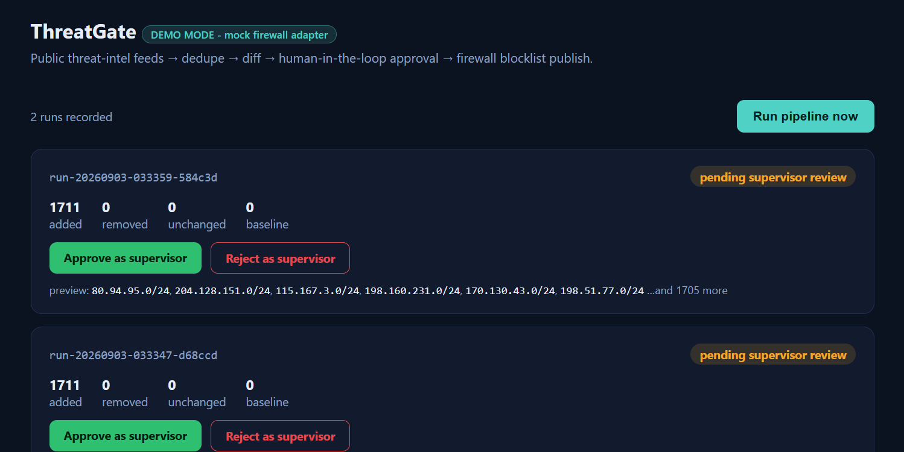
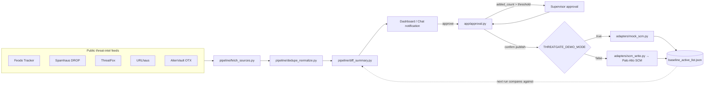

# ThreatGate

**Public threat-intel feeds → dedupe → diff → human-in-the-loop approval → firewall blocklist publish.**

ThreatGate pulls indicators of compromise from several public threat-intelligence feeds, merges and deduplicates them, computes what changed since the last approved list, and routes that change through a lightweight, signed-link approval workflow before it's ever written to a firewall. Nobody gets auto-blocked by an automation script having a bad day — a human always clicks approve first, and a second, separate click confirms the actual publish.

**[Live demo](https://threatgate.onrender.com) — click "Run pipeline now" to watch it fetch real public feeds end-to-end.** *(replace with your actual Render URL)*

> 這個專案示範一套「公開威脅情資 → 去重 → 差異比對 → 人工核准 → 防火牆黑名單發布」的自動化流程,重點在於用簽章連結取代額外的登入系統做核准關卡,並把「核准」跟「真正寫入防火牆」拆成兩個獨立動作。程式碼與註解為中英雙語,方便不同背景的讀者閱讀。



---

## Why this exists

A previous version of this project was built against a real company's firewall infrastructure. **This public repository is a from-scratch, sanitized rebuild** — same architecture and design decisions, but running entirely against public data sources, with a mock firewall adapter standing in for the real one. No proprietary code, internal URLs, credentials, or real network ranges are in this repo. See [`adapters/mock_scm.py`](adapters/mock_scm.py) vs [`adapters/scm_write.py`](adapters/scm_write.py) for how the demo/production split works.

## What it demonstrates

- **Stateless, signed approval links** (HMAC-SHA256, time-boxed) instead of building a login system just to gate one decision.
- **Two-key design**: approving a change and *publishing* it are separate, separately-confirmed actions — a burst of noisy indicators can be approved for review without silently reaching production.
- **Escalation on scale**: an unusually large change automatically requires a second (supervisor) approval instead of trusting a single click.
- **State-transition guards**: a stale approve/reject link can never overwrite a decision that's already final (tested explicitly — see `tests/test_approval_flow.py::TestStateTransitionGuards`).
- **Anomaly detection**: a diff that grows far faster than history predicts gets flagged for a second look instead of sailing through.
- **Idempotent, verified publish**: content is written then immediately read back to confirm the write; the baseline only advances after publish actually succeeds, and a failed publish surfaces loudly instead of failing silently.
- **Graceful multi-source degradation**: five independent feeds, each wrapped so one dead/unauthenticated source never takes down the run.
- **A real adapter boundary**: swap `THREATGATE_DEMO_MODE` and the exact same approval/pipeline code talks to a real Palo Alto Strata Cloud Manager tenant instead of the mock.

## Architecture



## Tech stack

Python · Flask · APScheduler · openpyxl · Palo Alto Strata Cloud Manager REST API (real adapter) · pytest

## Quick start (local)

```bash
git clone <this-repo>
cd threatgate
python -m venv .venv && source .venv/bin/activate   # Windows: .venv\Scripts\activate
pip install -r requirements-dev.txt

cp .env.example .env
# edit .env - at minimum set APPROVAL_SECRET_KEY to a random value:
#   python -c "import secrets; print(secrets.token_urlsafe(32))"

python wsgi.py
# open http://127.0.0.1:5000 and click "Run pipeline now"
```

By default `THREATGATE_DEMO_MODE=true`, so no firewall/SCM credentials are needed at all — the pipeline runs against the real public feeds (Feodo Tracker and Spamhaus DROP need no key; ThreatFox/URLhaus/OTX are skipped gracefully unless you add their free API keys) and "publishing" writes to a local mock adapter.

## Running the tests

```bash
pytest tests/ -v
```

29 tests, all offline/mocked — unit tests per feed parser (happy path + malformed data), the full approval state machine (approve, reject-with-reason, escalation, expiry, anti-replay guards), and an end-to-end integration run including a simulated publish failure and recovery.

## Deploying the public demo

**Render (recommended, free tier):**

1. Push this repo to your own GitHub account.
2. In Render: **New → Blueprint**, point it at your fork — `render.yaml` in this repo configures the service.
3. Set `APPROVAL_API_BASE_URL` to the `https://...onrender.com` URL Render assigns you (Render can only tell you this after the first deploy, so redeploy once you know it).
4. Done — `THREATGATE_DEMO_MODE` defaults to `true`, so no other secrets are required.

Optional environment variables (all safe to leave unset): `ABUSECH_AUTH_KEY` and `OTX_API_KEY` (free registration, unlocks 3 more feeds), `GOOGLE_CHAT_WEBHOOK_URL` (chat notifications on top of the dashboard).

**Free-tier note:** Render's free web service sleeps after inactivity and its filesystem is ephemeral — a redeploy or a cold start after sleep clears `data/`. That's fine for a portfolio demo (click "Run pipeline now" to repopulate it); a real deployment would put state in a proper database instead of local JSON files.

## Environment variables

| Variable | Required | Purpose |
|---|---|---|
| `APPROVAL_SECRET_KEY` | yes | HMAC signing key for approval tokens |
| `APPROVAL_API_BASE_URL` | yes | Public base URL, used to build approve/reject/publish links |
| `THREATGATE_DEMO_MODE` | no (default `true`) | `true` = mock firewall adapter, `false` = real SCM adapter |
| `ABUSECH_AUTH_KEY` | no | Free key unlocking ThreatFox + URLhaus |
| `OTX_API_KEY` | no | Free key unlocking AlienVault OTX |
| `GOOGLE_CHAT_WEBHOOK_URL` | no | Optional chat notifications |
| `ESCALATION_THRESHOLD` | no (default `500`) | Added-count that triggers supervisor review |
| `PIPELINE_INTERVAL_MINUTES` | no (default `60`) | Background schedule; `0` disables auto-runs |
| `ORG_OWN_RANGES_JSON` | no (real deployments only) | Your organization's public ranges, so the pipeline never blocks itself |
| `SCM_CLIENT_ID` / `SCM_CLIENT_SECRET` / `SCM_TSG_ID` | no (real deployments only) | Palo Alto SCM service-account credentials |

Full list with comments: [`.env.example`](.env.example).

## Project structure

```
app/            Flask app: dashboard, approval engine, scheduler, chat notifications
pipeline/       fetch -> dedupe/normalize -> diff -> Excel report
adapters/       scm_client.py + scm_write.py (real SCM), mock_scm.py (demo)
tests/          pytest - unit + integration, all mocked/offline
scripts/        run_internal.py - launcher for a real, internal-only deployment
```

## Using this against a real firewall

Set `THREATGATE_DEMO_MODE=false`, provide `SCM_CLIENT_ID` / `SCM_CLIENT_SECRET` / `SCM_TSG_ID` for a Palo Alto Strata Cloud Manager service account, set `ORG_OWN_RANGES_JSON` to your own public ranges, and run `scripts/run_internal.py` bound to an internal-only interface — **not** `wsgi.py`, which is built for the public demo and binds openly on purpose. The approval API talking to a real firewall should never be reachable from the internet.

## License

MIT — see [LICENSE](LICENSE).
